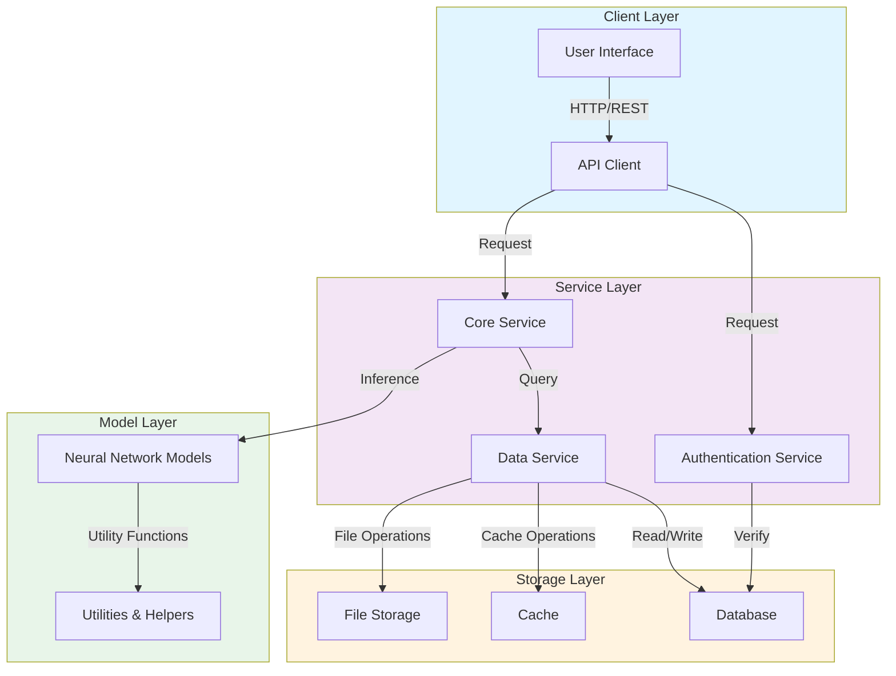

# Architecture Overview

## System Architecture

## Component Descriptions

### Client Layer
- **User Interface**: Frontend application for user interactions
- **API Client**: HTTP client for communicating with backend services

### Service Layer
- **Authentication Service**: Handles user authentication and authorization
- **Core Service**: Main business logic and orchestration
- **Data Service**: Manages data operations and access

### Model Layer
- **Neural Network Models**: ML models for inference and training
- **Utilities & Helpers**: Common functions and utilities used across the system

### Storage Layer
- **Database**: Primary data persistence
- **Cache**: Fast access to frequently used data
- **File Storage**: Stores models, datasets, and other files

## Data Flow

1. **Request Initiation**: Client sends request through API
2. **Authentication**: Request is validated through authentication service
3. **Processing**: Core service processes the request and may invoke ML models
4. **Data Access**: Data service handles all storage layer interactions
5. **Response**: Result is returned to the client

---

*Last Updated: 2026-05-08*
